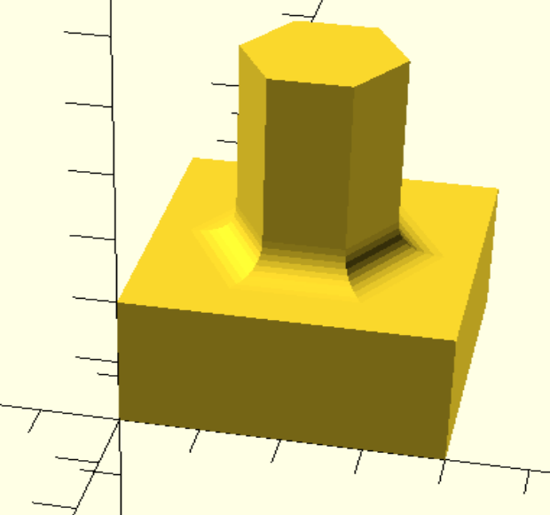
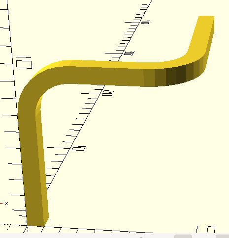
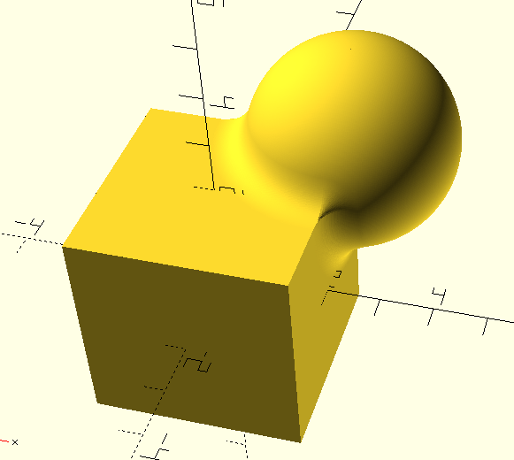
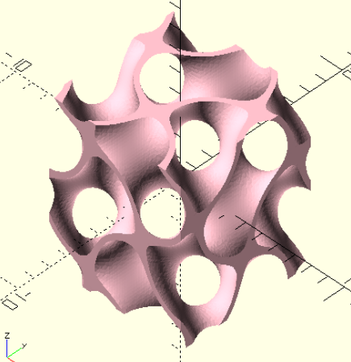
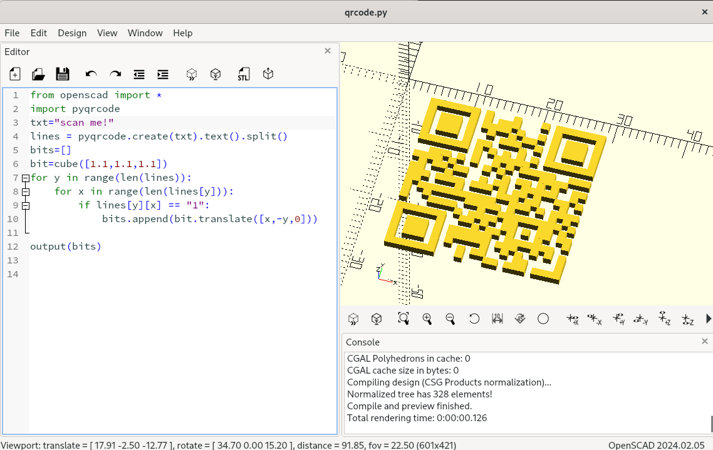
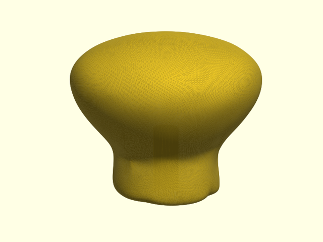

# PythonSCAD

<p class="hero-tagline">The simplicity of OpenSCAD.<br>The full power of Python.</p>

PythonSCAD is a script-based 3D modeler with a full GUI. Write parametric,
engineering-oriented models in real Python, see them live, and export to STL,
3MF, and other formats for 3D printing and manufacturing — with fillets, SDFs,
and the whole pip ecosystem that plain OpenSCAD can't offer.

<div id="hero-download" class="hero-download">
  <div class="hero-download-fallback">
    <p class="hero-download-actions">
      <a class="md-button md-button--primary hero-download-button"
         href="https://github.com/pythonscad/pythonscad/releases/latest">
        Download latest release
      </a>
      <a class="md-button hero-download-all" href="downloads/">All downloads</a>
    </p>
    <p class="hero-download-file">
      Releases on
      <a href="https://github.com/pythonscad/pythonscad/releases">GitHub</a>
    </p>
  </div>
  <p class="hero-download-loading" hidden aria-live="polite">Loading latest release…</p>
  <noscript>
    <p class="download-noscript-note">
      JavaScript is not required to use this website. If you enable it though,
      this page can detect your operating system and suggest the best download path
      (for example APT on Debian/Ubuntu, YUM on Fedora/RHEL, etc.), show the current release version,
      and link directly to the matching download.
    </p>
  </noscript>
  <div class="hero-download-enhanced" hidden></div>
</div>

[Try in browser](https://www.pythonscad.org/playground/){ .md-button .md-button--primary target="_blank" rel="noopener" aria-label="Try in browser (opens in a new tab)" }
[Get started](get_started.md){ .md-button }
[Tutorial](tutorial/getting_started.md){ .md-button }
[All downloads](downloads.md)

No install required — the [in-browser Playground](https://www.pythonscad.org/playground/)
runs the full PythonSCAD kernel via WebAssembly.


## What you get on top of OpenSCAD

<div class="feature-cards" markdown>

-   { loading=lazy }

    **Fillets and rounded seams**

    Round edges with `fillet()`, or round only the seams of a boolean with
    `union(a, b, r=2)`.

    [:octicons-arrow-right-24: fillet](reference/fillet.md)

-   { loading=lazy }

    **Sweep along any path**

    `path_extrude()` sweeps a profile along a 3D path, with twist, scaling, and
    rounded corners.

    [:octicons-arrow-right-24: path_extrude](reference/extrusions.md#path_extrude)

-   { loading=lazy }

    **SDF and implicit modeling**

    Built-in libfive for smooth blends and organic shapes that plain CSG
    cannot produce.

    [:octicons-arrow-right-24: F-Rep / SDF](reference/frep.md)

-   { loading=lazy }

    **Lattices from a formula**

    Write a gyroid or any other implicit surface as a single math expression
    and get a printable lattice.

    [:octicons-arrow-right-24: Gyroid example](examples/gyroid.txt)

-   { .shot loading=lazy }

    **The whole pip ecosystem**

    Any Python package is one `import` away: this QR code comes straight from
    the `pyqrcode` package.

    [:octicons-arrow-right-24: Example script](examples/qrcode.txt)

-   { loading=lazy }

    **Shapes from a point cloud**

    `organic()` wraps a cloud of points into a smooth, watertight solid —
    sketch a knob, a grip, or a figure from a few coordinates.

    [:octicons-arrow-right-24: Knob example](examples/organic_knob.txt)

</div>

## One app, three languages

PythonSCAD runs your model in whichever language you prefer: plain Python,
classic OpenSCAD `.scad` code, or build123d once you import its module. Here is the same desk organizer, sized automatically from a list of
slots, in each of them.

=== "Python"

    ```python
    from pythonscad import *

    # A desk organizer, sized from your own data
    slots = {"pens": 14, "markers": 18, "ruler": 30}
    wall = 6

    length = sum(slots.values()) + wall * (len(slots) + 1)
    tray = cube([length, 40, 20]).fillet(2, fn=8)

    x = wall
    for name, width in slots.items():
        tray -= cube([width, 40 - 2 * wall, 20]) + [x, wall, 4]
        x += width + wall

    tray.show()
    ```

    Ordinary Python: a dictionary, a `for` loop, `sum()`, and a one-line
    `fillet()`.

=== "OpenSCAD"

    ```openscad
    slots = [14, 18, 30];   // no dictionaries: the names are gone
    wall = 6;

    // no built-in sum(): write a recursive helper
    function sum(v, i = 0) = i < len(v) ? v[i] + sum(v, i + 1) : 0;
    function pos(i) = wall + sum([for (j = [0:1:i-1]) slots[j]]) + i * wall;
    length = sum(slots) + wall * (len(slots) + 1);

    difference() {
      // no fillet(): approximate with a (slow) minkowski sum
      translate([2, 2, 2])
        minkowski() { cube([length - 4, 36, 16]); sphere(2, $fn = 16); }
      for (i = [0 : len(slots) - 1])
        translate([pos(i), wall, 4]) cube([slots[i], 40 - 2 * wall, 20]);
    }
    ```

    Existing `.scad` files open and render as they always did, but plain
    OpenSCAD needs workarounds for the sum and the rounded edges.

=== "build123d"

    ```python
    from pythonscad import *
    from build123d import *
    from pybuild123d import build123d   # ships with PythonSCAD

    @build123d   # turns the B-rep result into a PythonSCAD solid
    def organizer(slots, wall=6):
        length = sum(slots.values()) + wall * (len(slots) + 1)
        with BuildPart() as tray:
            Box(length, 40, 20, align=Align.MIN)
            fillet(tray.edges(), radius=2)
            x = wall
            for width in slots.values():
                with Locations((x, wall, 4)):
                    Box(width, 40 - 2 * wall, 20,
                        align=Align.MIN, mode=Mode.SUBTRACT)
                x += width + wall
        return tray

    organizer({"pens": 14, "markers": 18, "ruler": 30}).show()
    ```

    Install `build123d` with pip, and its models appear in the PythonSCAD
    viewer, ready to combine with everything else.

<!-- TODO: add a GUI screenshot of the organizer, e.g. pictures/organizer.png -->

## Made for real workflows

<div class="workflow-table" markdown>

| | |
|---|---|
| :material-web: **Runs in your browser** | The full kernel compiled to WebAssembly. Try it without installing anything. [Open the Playground ↗](https://www.pythonscad.org/playground/){ target="_blank" rel="noopener" } |
| :material-notebook-outline: **Jupyter notebooks** | Model, document, and iterate inside a notebook next to your analysis. [Jupyter setup](jupyter.md) |
| :material-bookshelf: **Your OpenSCAD libraries** | Load existing `.scad` libraries such as MCAD with `osuse()` and call their modules from Python. [osuse](reference/io.md#osuse) |
| :material-file-chart-outline: **Read any data format** | Parse CSV, JSON, or even chip layouts (GDS) with plain Python and turn the data into geometry. [GDS example](examples/read_gds.txt) |
| :material-anchor: **Handles and align** | Attach named reference frames to parts and assemble them with `align()` instead of computing transformations by hand. [Handles](reference/align.md) |

</div>

## How does it compare?

<div class="compare-table" markdown>

| | OpenSCAD | CadQuery / build123d | **PythonSCAD** |
|---|:---:|:---:|:---:|
| Languages | OpenSCAD language | Python | **Python, OpenSCAD, build123d** |
| Variables, classes, dicts, file I/O | limited | ✓ | **✓** |
| pip packages (NumPy, qrcode, …) | – | ✓ | **✓** |
| Edge fillets | workarounds | ✓ | **✓** |
| Reuse existing `.scad` libraries | ✓ | – | **✓** |
| Built-in editor, live preview, customizer | ✓ | separate tools | **✓** |
| SDF / implicit modeling | – | – | **✓** |
| Runs in the browser | ✓ | – | **✓** |
| Geometry kernel | mesh | B-rep (STEP export) | mesh |

</div>

Need exact B-rep geometry and STEP files for mechanical CAD exchange? CadQuery
and build123d are great choices. Want OpenSCAD's quick, script-to-print
workflow with a real programming language behind it? That's PythonSCAD.

## Is PythonSCAD for you?

### A great fit if you…

- think in code and want precise, repeatable parametric models
- already know Python — or want to **learn Python or programming** through something tangible
- have OpenSCAD designs and libraries but keep hitting the limits of its language
- need models for 3D printing, CNC, or engineering workflows

### Probably not the right tool if you…

- need organic sculpting, animation, or VFX → [Blender](https://www.blender.org/)
- prefer click-to-design CAD → [FreeCAD](https://www.freecad.org/)

## Learn more

1. [Download](downloads.md) for your platform — or use the button above
2. [Installation](installation.md) — APT/YUM repos, AppImage, PyPI, and build options
3. [Getting Started tutorial](tutorial/getting_started.md) — hands-on walkthrough
4. [Coming from OpenSCAD?](tutorial/from_openscad.md) — what changes and what stays
5. [Cheat sheet](cheatsheet.md), [Examples gallery](examples.md), and [API reference](reference/primitives3d.md)

## Community

- [PyForge](https://pyforge.zima.digirent.nl) — share and remix PythonSCAD designs
- [r/OpenPythonSCAD](https://www.reddit.com/r/OpenPythonSCAD/)
- [Google Group](https://groups.google.com/g/pythonscad)
- [Community wiki](http://old.reddit.com/r/openpythonscad/wiki/index)
- [IDE and type-checker setup](installation.md#project-local-environment-for-ide-support)
- [Contact & support](contact.md)

---

PythonSCAD is open source on [GitHub](https://github.com/pythonscad/pythonscad). It builds on
the solid foundation of [OpenSCAD](https://openscad.org) and stays closely synced with upstream;
Python-specific features are developed here. See [Upstream sync](development/upstream-sync.md).
